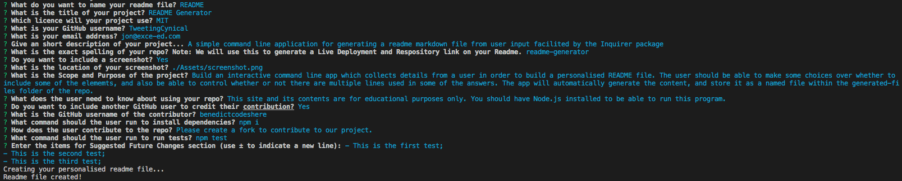

# README Generator


## A simple command line application for generating a readme markdown file from user input facilited by the Inquirer package. Note: This readme file was created using this README generator.

<!-- TABLE OF CONTENTS -->
  <details>
    <summary>Table of Contents</summary>
    <ol>
          <li><a href="#about-the-project">About The Project</a></li>
          <li><a href="#deployment">Deployment / Code Repository</a></li>
          <li><a href="#screenshot">Screenshot</a></li>
          <li><a href="#scope-and-purpose">Scope and Purpose</a></li>
          <li><a href="#usage">Usage</a></li>
          <li><a href="#credits">Credits</a></li>
          <li><a href="#installation">Installation</a></li>
          <li><a href="#questions">Questions</a></li>
          <li><a href="#contributions">Contributions</a></li>
          <li><a href="#tests">Tests</a></li>
          <li><a href="#suggested-future-changes">Suggested Future Changes</a></li>
          <li><a href="#license">License</a></li>
        </ol>
  </details>

  <!-- About the Project -->

## About the Project

### Deployment / Code Repository

[Live Deployment](https://TweetingCynical.github.io/readme-generator/)

[Repository](https://github.com/TweetingCynical/readme-generator)

[Video Walkthrough](https://drive.google.com/file/d/17XvcqDKRhH-g58sJVA9bk-Litg_0h0pE/view)
NOTE: This video walkthrough talks through the added extras I created in this project, and also how I found solutions to some of the problems I faced. If you wish to skip this part of the walkthrough, and go straight the demonstration of my app, this can be found at the 14:45 mark of the video.

### Screenshot

Working version of the app should look like this:


### Scope and Purpose

Build an interactive command line app which collects details from a user in order to build a personalised README file. The user should be able to make some choices over whether to include some of the elememts, and also be able to control whether or not there are multiple lines used in some of the answers. The app will automatically generate the content, and store it as a named file within the generated-files folder of the repo.

### Usage

This site and its contents are for educational purposes only. You should have Node.js installed to be able to run this program.

### Credits

The following people have contributed to this app:

- [TweetingCynical](https://github.com/TweetingCynical)

### Installation

To install the necessary tendencies, you must run the following command:

```
npm i
```

### Questions

If you have any questions or to report bugs, please [open a new issue](https://github.com/TweetingCynical/readme-generator/issues/new) or [email us](mailto:jon@exce-ed.com?subject=readme-generator)

You can find more of my work at [TweetingCynical](https://github.com/TweetingCynical)

### Contributing

Please create a fork to contribute to our project.

### Tests

To run tests, run the following command:

```
npm test
```

### Suggested Future Changes

- ✅ ~~Allow users to choose whether to add a screenshot;~~
- ✅ ~~Add an email validation;~~
- ✅ ~~Allow users to add multilines to their suggested future changes by including a delimeter (±);~~
- Allow users to add more than one contributor;
- Allow users to add code snippets to a new section named Overview of Build;
- Add other options for Licenses;

### License

MIT License

Copyright (c)

Permission is hereby granted, free of charge, to any person obtaining a copy
of this software and associated documentation files (the "Software"), to deal
in the Software without restriction, including without limitation the rights
to use, copy, modify, merge, publish, distribute, sublicense, and/or sell
copies of the Software, and to permit persons to whom the Software is
furnished to do so, subject to the following conditions:

The above copyright notice and this permission notice shall be included in all
copies or substantial portions of the Software.

THE SOFTWARE IS PROVIDED "AS IS", WITHOUT WARRANTY OF ANY KIND, EXPRESS OR
IMPLIED, INCLUDING BUT NOT LIMITED TO THE WARRANTIES OF MERCHANTABILITY,
FITNESS FOR A PARTICULAR PURPOSE AND NONINFRINGEMENT. IN NO EVENT SHALL THE
AUTHORS OR COPYRIGHT HOLDERS BE LIABLE FOR ANY CLAIM, DAMAGES OR OTHER
LIABILITY, WHETHER IN AN ACTION OF CONTRACT, TORT OR OTHERWISE, ARISING FROM,
OUT OF OR IN CONNECTION WITH THE SOFTWARE OR THE USE OR OTHER DEALINGS IN THE
SOFTWARE.
